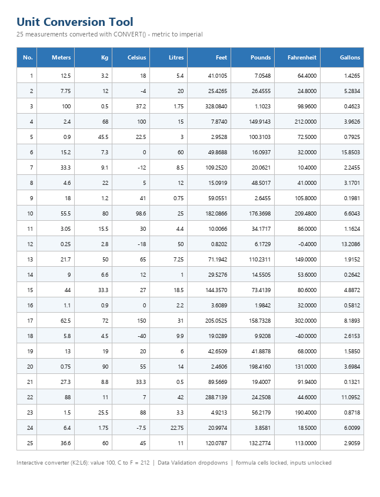

# Unit Conversion Tool

**Practice exercise** — Excel



## Purpose

Convert 25 sets of measurements between metric and imperial units, and provide an interactive converter with a validated unit selector.

## Structure

| Range | Contents |
|---|---|
| A–E | 25 rows of measurements in metres, kilograms, Celsius and litres |
| F–I | Converted values: feet, pounds, Fahrenheit, gallons |
| H2:I6 | Unit map used by VLOOKUP to pick the target unit |
| K9:K16 | Unit code list feeding the dropdowns |
| K2:L6 | Interactive converter (value, from unit, to unit, result) |

## How it works

Each conversion column uses:

```excel
=CONVERT(value, from_unit, to_unit)
```

The interactive converter reads three input cells:

```excel
=IFERROR(CONVERT(L3,L4,L5),"Pick both units")
```

## Unit codes

| Quantity | Metric | Imperial |
|---|---|---|
| Length | `m` | `ft` |
| Mass | `kg` | `lbm` |
| Temperature | `C` | `F` |
| Volume | `l` | `gal` |

Codes are **case-sensitive** — `C` is Celsius, `c` is not.

## Protection

All formula cells are locked. Only the input cells (**B2:E26** and **L3:L5**) are unlocked, so the sheet can be used without accidentally overwriting the conversions. The sheet is protected with "Format cells" allowed so formatting remains editable.

## Notes

- Incompatible unit combinations return `#N/A`, handled with `IFERROR`.
- If `CONVERT` is unavailable, temperature can be computed arithmetically: `=C*9/5+32`.

## Skills demonstrated

`CONVERT` · `VLOOKUP` · Data Validation lists · Worksheet protection with unlocked inputs · Mixed references · Number formatting
